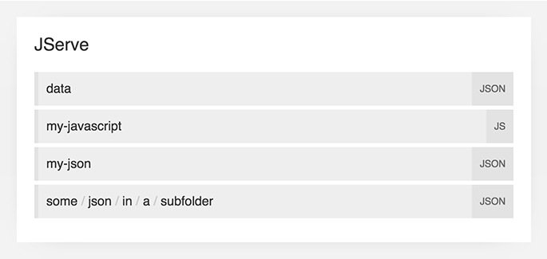

JServe
=======

Serve up JSON files.

[![NPM version][shield-npm]][info-npm]
[![Node.js version support][shield-node]][info-node]
[![Build status][shield-build]][info-build]
[![Code coverage][shield-coverage]][info-coverage]
[![Dependencies][shield-dependencies]][info-dependencies]
[![MIT licensed][shield-license]][info-license]


Table Of Contents
-----------------

- [Serving JSON Files](#serving-json-files)
- [Command-Line Interface](#command-line-interface)
- [JavaScript Interface](#javascript-interface)
- [Configuration](#configuration)
- [Contributing](#contributing)
- [Support and Migration](#support-and-migration)
- [License](#license)


Serving JSON Files
------------------



Whether you're running JServe through the [Command-Line](#command-line-interface) or [JavaScript](#javascript-interface) interfaces, it will accept a directory of JSON (or JavaScript) files and serve them through a web server.

If you run JServe on port `3000`, and you have the following JSON files:

```
./json
├── foo.json
├── bar.json
└── baz.js
```

Then you will be able to visit http://localhost:3000/foo to see the contents of `foo.json`.

If you navigate to the index page of a running JServe application (e.g. http://localhost:3000/) you will see a HTML index page listing all of the available JSON files.

When using JavaScript files in place of JSON, you must use `module.exports` to decide what gets output:

```js
module.exports = {
    foo: 'bar'
};
```

These JavaScript files are run in a limited Node.js sandbox to prevent them from crashing JServe.


Command-Line Interface
----------------------

Install JServe globally with [npm][npm]:

```sh
npm install -g jserve
```

This installs the `jserve` command-line tool:

```
  Usage: jserve [options]

  Options:

    -h, --help                         output usage information
    -V, --version                      output the version number
    -p, --port <port>                  the port to run on. Default: 3000
    -j, --json <path>                  the path to look for JSON files in. Default: ./json
    -c, --content-type <content-type>  the Content-Type header to send when serving JSON. Default: application/json
    -i, --indentation <level>          The number of spaces or tabs to use for JSON indentation. Default: 4
    -t, --templates <path>             The path to look for template files in
    -n, --name <name>                  The name of the server, used in template headings. Default: JServe
```

Run JServe on port `1234`:

```sh
jserve --port 1234
```

Run JServe on a different directory of JSON files:

```sh
jserve --json ./my-folder-of-json
```

Run JServe, outputting JSON with a different content-type and tab-indentation:

```sh
jserve --content-type application/my-custom+json --indentation \t
```


JavaScript Interface
--------------------

Install JServe with [npm][npm] or add to your `package.json`:

```
npm install jserve
```

Require JServe:

```js
const jserve = require('jserve');
```

Create a JServe application, [passing in options](#configuration):

```js
const app = jserve({
    // options
});
```

Start the JServe application:

```js
app.start();
```


Configuration
-------------

### `contentType`

_String_. The `Content-Type` header to send when serving JSON and JavaScript files. Default: `application/json`.

```js
const app = jserve({
    contentType: 'application/my-custom+json'
});
```

### `description`

_String_. The descriptive text which appears above the file list in the index page. Default: `View JSON files by clicking the file names below:`.

```js
const app = jserve({
    description: 'Try one of these on for size:'
});
```

### `indentation`

_Number_ or _String_. The indentation level to use for output JSON. If set to a number, indentation will be set to that number of spaces. If set to a string, the given string will be used to indent. Default: `4`.

```js
const app = jserve({
    indentation: '\t'
});
```

### `log`

_Object_. An object with the methods `debug`, `error`, and `info` which will be used to report errors and request information. Default: no op functions.

```js
const app = jserve({
    log: {
        debug: console.log.bind(console),
        error: console.error.bind(console),
        info: console.log.bind(console)
    }
});
```

### `middleware`

_Array_. An array of [Connect][connect] middleware which will be run before the index and JSON serving parts of JServe. Along with the `template` option, this allows you to extend JServe easily with functionality of your own. Default: `[]`.

```js
const app = jserve({
    middleware: [
        function (request, response, next) {
            if (request.path === '/hello') {
                return response.end('Hello World!');
            }
            next();
        }
    ]
});
```

### `name`

_String_. The name of the server, which appears in page titles and the logs. Default: `JServe`.

```js
const app = jserve({
    name: 'My JSON'
});
```

### `path`

_String_. The path to look for JSON and JavaScript files in. It's best to set this to an absolute path. Default: `./json`.

```js
const app = jserve({
    path: `${__dirname}/my-folder-of-json`
});
```

### `port`

_Number_. The port to bind the JServe application to. Default: The `PORT` environment variable or `3000`.

```js
const app = jserve({
    port: 1234
});
```

### `templatesPath`

_String_. The path that JServe should look for HTML templates in. JServe expects to find at least two files in the given directory: `error.html` and `index.html`. These templates are written in [Mustache][mustache]. Default: [`<core>/template`](template).


Contributing
------------

To contribute to JServe, clone this repo locally and commit your code on a separate branch.

Please write unit tests for your code, and check that everything works by running the following before opening a pull-request:

```sh
make ci
```


Support and Migration
---------------------

JServe major versions are normally supported for 6 months after their last minor release. This means that patch-level changes will be added and bugs will be fixed. The table below outlines the end-of-support dates for major versions, and the last minor release for that version.

We also maintain a [migration guide](MIGRATION.md) to help you migrate.

| :grey_question: | Major Version | Last Minor Release | Node.js Versions | Support End Date |
| :-------------- | :------------ | :----------------- | :--------------- | :--------------- |
| :heart:         | 2             | N/A                | 4+               | N/A              |
| :hourglass:     | 1             | 1.2                | 0.10–5           | 2016-09-13       |

If you're opening issues related to these, please mention the version that the issue relates to.


License
-------

JServe is licensed under the [MIT][info-license] license.  
Copyright &copy; 2015, Rowan Manning


[connect]: https://github.com/senchalabs/connect
[mustache]: https://mustache.github.io/
[npm]: https://www.npmjs.com/

[info-coverage]: https://coveralls.io/github/rowanmanning/jserve
[info-dependencies]: https://gemnasium.com/rowanmanning/jserve
[info-license]: LICENSE
[info-node]: package.json
[info-npm]: https://www.npmjs.com/package/jserve
[info-build]: https://travis-ci.org/rowanmanning/jserve
[shield-coverage]: https://img.shields.io/coveralls/rowanmanning/jserve.svg
[shield-dependencies]: https://img.shields.io/gemnasium/rowanmanning/jserve.svg
[shield-license]: https://img.shields.io/badge/license-MIT-blue.svg
[shield-node]: https://img.shields.io/badge/node.js%20support-4–5-brightgreen.svg
[shield-npm]: https://img.shields.io/npm/v/jserve.svg
[shield-build]: https://img.shields.io/travis/rowanmanning/jserve/master.svg
